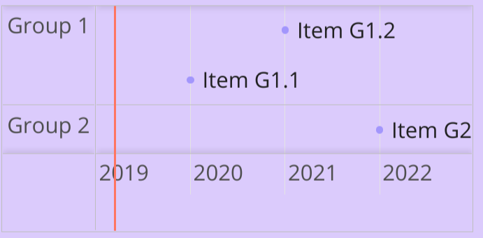

[](https://travis-ci.org/fegemo/bespoke-vis) [](https://coveralls.io/github/fegemo/bespoke-vis?branch=master) 

# bespoke-vis

Use [visjs][visjs] to include timelines (in the future, also charts and graphs)
in your bespoke.js presentation. See our
[demo](https://fegemo.github.io/bespoke-vis/).

## How to use

Only the HTML elements with the `data-vis="timeline"` attribute will be
turned into visjs elements. For example, to generate a timeline, the
following code

```html
<div data-vis="timeline" data-vis-url="data.json"></div>
```

...will render like:



It is also possible to render visjs elements by providing data as JSON content
inside the element markup, like so:

```html
<div data-vis="timeline">
  {
    "groups": [
      { "id": 1, "content": "Group 1" },
      { "id": 2, "content": "Group 2" }
    ],
    "items": [
       { "group": 1, "content": "Item G1.1", "start": "2020-01-01", "type": "point" },
       { "group": 1, "content": "Item G1.2", "start": "2021-01-01", "type": "point" },
       { "group": 2, "content": "Item G2.1", "start": "2022-01-01", "type": "point" }
     ],
     "options": {
       "width": "100%",
       "height": "250px",
       "min": "2019-01-01",
       "max": "2023-01-01",
       "zoomMin": 2592000000,
       "zoomMax": 788400000000
     }
   }
</div>
```

Either the JSON file or the content inside the element must have an object
with the following properties:

- `options`: [optional] a set of configurations that will be directly
  provided to visjs. See visjs' documentation for what is supported.
- `groups`: [optional] an array of objects indicating groups that will be
  used by the respective visualization to group the data items.
- `items`: [mandatory] an array with timed events to display.

## Download

Download the [production version][min] or the [development version][max], or use a [package manager](#package-managers).

[min]: https://raw.github.com/fegemo/bespoke-vis/master/dist/bespoke-vis.min.js
[max]: https://raw.github.com/fegemo/bespoke-vis/master/dist/bespoke-vis.js
[katex]: http://khan.github.io/KaTeX/

## Usage

This plugin is shipped in a [UMD format](https://github.com/umdjs/umd), meaning that it is available as a CommonJS/AMD module or browser global.

For example, when using CommonJS modules:

```js
vaconst bespoke = require('bespoke'),
  vis = require('bespoke-vis');

bespoke.from('#presentation', [
  vis()
]);
```

When using browser globals:

```js
bespoke.from('#presentation', [
  bespoke.plugins.vis()
]);
```

## Inclusion of visjs' CSS/Font files

Vis.js is composed of javascript and CSS files.

This plugin, when a visjs element (`[data-vis]`) is found on the bespoke deck,
injects the CSS file into de document head (by
using [browserify-css](https://github.com/cheton/browserify-css)).

## Package managers

### npm

```bash
$ npm install bespoke-vis
```

## Credits

This plugin was built with [generator-bespokeplugin](https://github.com/markdalgleish/generator-bespokeplugin).

## License

[MIT License](http://en.wikipedia.org/wiki/MIT_License)
